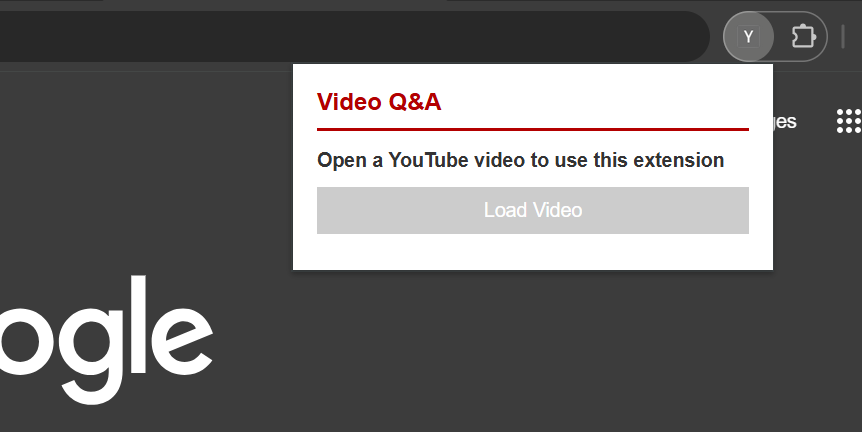
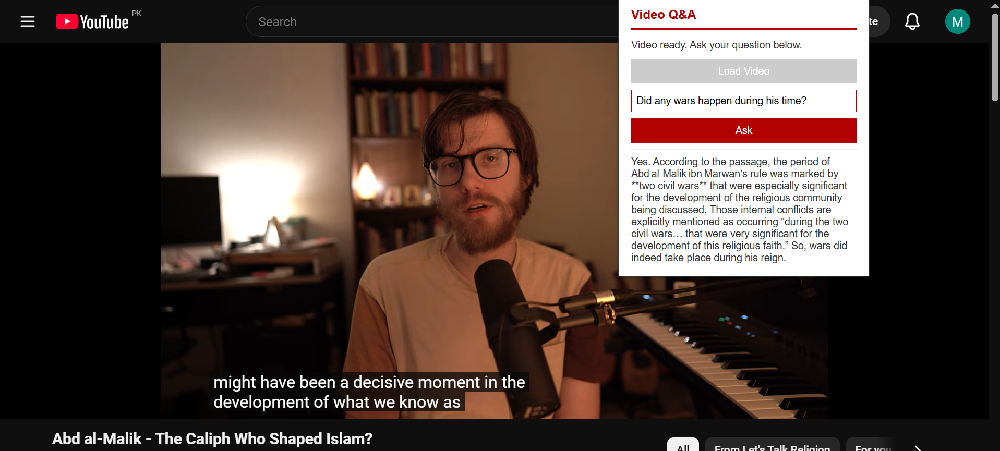

<div align="center">

# 🎬 YouTube Video Q&A — Chrome Extension

### Ask questions about any YouTube video and get instant, context-aware answers powered by AI.

[](https://www.python.org/)
[](https://fastapi.tiangolo.com/)
[](https://www.langchain.com/)
[](https://groq.com/)
[](https://www.trychroma.com/)
[](https://github.com/yt-dlp/yt-dlp)
[](https://developer.chrome.com/docs/extensions/mv3/intro/)
[](https://huggingface.co/)

</div>

---

## 📖 Overview

**YouTube Video Q&A** is a lightweight Chrome extension paired with a local Python backend that lets you ask natural-language questions about any YouTube video — directly from your browser. It pulls the video's captions, breaks them into searchable chunks, embeds them into a vector store, and uses a fast LLM to answer your questions using only the video's actual content.

No more scrubbing through a 40-minute video looking for the one thing someone said. Just ask.

---

## ✨ Features

- 🎯 **Automatic caption extraction** — pulls subtitles straight from YouTube via `yt-dlp`, no manual transcript needed
- 🧠 **Retrieval-Augmented Generation (RAG)** — answers are grounded in the actual video content, not hallucinated
- ⚡ **Groq-powered inference** — near-instant responses using Groq's LPU-accelerated LLMs
- 💾 **Smart caching** — each video's embeddings are stored once and reused, so re-asking questions is instant
- 🎨 **Minimal, clean UI** — no clutter, no gradients, just a simple red-and-white popup that gets out of your way
- 🛡️ **Robust error handling** — clear feedback for missing captions, unreachable backend, or invalid videos

---

## 🖼️ Screenshots

<div align="center">

**Popup on a non-YouTube page**



**Asking a question on an active video**



</div>

---

## 🏗️ Architecture

```
┌─────────────────┐         ┌──────────────────┐         ┌─────────────────┐
│  Chrome Popup    │  HTTP   │  FastAPI Backend │         │   Groq LLM      │
│  (HTML/CSS/JS)   │ ──────► │  (Python)        │ ──────► │  (gpt-oss-120b) │
└─────────────────┘         └────────┬─────────┘         └─────────────────┘
                                      │
                       ┌──────────────┼───────────────┐
                       ▼              ▼               ▼
                  ┌─────────┐   ┌───────────┐   ┌──────────────┐
                  │ yt-dlp  │   │  Chroma   │   │ HuggingFace  │
                  │ (VTT)   │   │ (Vectors) │   │ (Embeddings) │
                  └─────────┘   └───────────┘   └──────────────┘
```

---

## 🛠️ Tech Stack

| Layer | Technology |
|---|---|
| **Extension UI** | HTML, CSS, JavaScript (Chrome Manifest V3) |
| **Backend API** | FastAPI (Python) |
| **Caption Extraction** | yt-dlp + webvtt-py |
| **Text Splitting** | LangChain `RecursiveCharacterTextSplitter` |
| **Embeddings** | HuggingFace `sentence-transformers/all-MiniLM-L6-v2` |
| **Vector Store** | ChromaDB (persisted per video) |
| **LLM Inference** | Groq API (`openai/gpt-oss-120b`) |
| **Orchestration** | LangChain |

---

## 🚀 Getting Started

### 1. Clone the repo

```bash
git clone https://github.com/MuhammadSarimUmer/Youtube_QA_ChromeExtension.git
cd Youtube_QA_ChromeExtension
```

### 2. Set up the backend

```bash
cd backend
pip install -r requirements.txt
cp .env.example .env
```

Add your Groq API key to `.env`:

```
GROQ_API_KEY=your_actual_key_here
```

Start the server:

```bash
uvicorn main:app --reload --port 8000
```

### 3. Load the extension into Chrome

1. Open `chrome://extensions`
2. Enable **Developer mode** (top-right toggle)
3. Click **Load unpacked**
4. Select the `extension` folder

### 4. Use it

1. Open any YouTube video with captions
2. Click the extension icon in your toolbar
3. Click **Load Video** and wait for processing
4. Type a question and hit **Ask**

---

## 📂 Project Structure

```
Youtube_QA_ChromeExtension/
├── backend/
│   ├── main.py
│   ├── requirements.txt
│   └── .env.example
├── extension/
│   ├── manifest.json
│   ├── popup.html
│   ├── popup.css
│   └── popup.js
└── imgs/
    ├── not_video.PNG
    └── yes_video.PNG
```

---

## ⚠️ Notes & Limitations

- Videos with captions disabled cannot be processed — the extension will surface a clear error in that case
- The backend must be running locally on port `8000` for the extension to function
- First-time embedding model load may take a moment while HuggingFace weights are cached locally

---

<div align="center">

</div>
